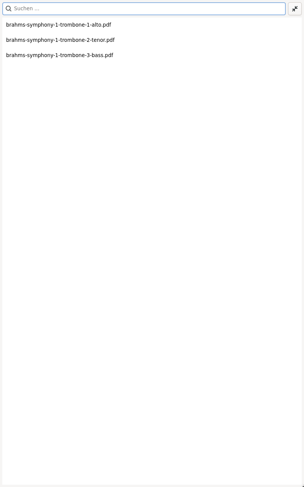
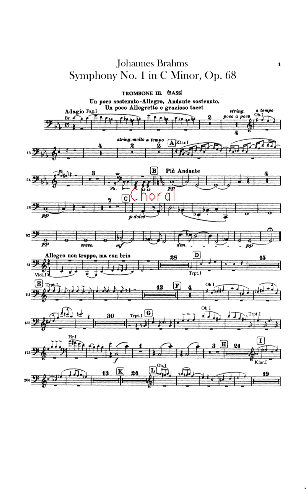
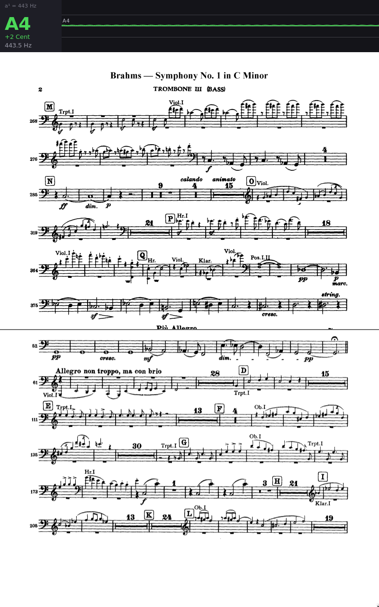
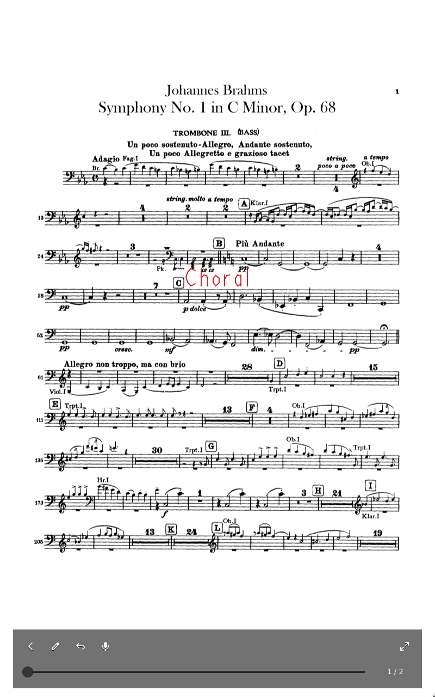

# frack

A penguin in tails for your music stand: **frack** is a sheet music
viewer for Linux (GTK4/Rust). Half-page turns (the next page's top half
appears first), foot pedal support (Page Up/Down), freehand annotations
with a stylus – burned directly into the PDF file. No database: the
library is just a directory, and sync and versioning are left to
external tools (git-annex, Syncthing).

## Screenshots

| Library | Freehand annotation |
| --- | --- |
|  |  |

| Half-page turn with tuner | Touch overlay (middle tap) |
| --- | --- |
|  |  |

In the half-page shot the top half of the next page has already
appeared, while the bottom half of the current page stays visible until
you finish it.

The screenshots are captured by a NixOS VM integration test
(`checks.<system>.screenshots`) that drives the real UI — including a
generated sine wave played into a loopback microphone for the tuner —
and are copied into the repository with `nix run .#update-screenshots`.
A second check compares the committed images against what the test
currently renders, so `nix flake check` fails if they go stale.

## Design goals

After many years of using various sheet music apps on both iOS and
Android, these are my convictions about how a music-stand app should
behave, and what frack grew out of:

- **A native Linux app.** GTK4/Rust, built for the Linux desktop — not a
  web app in a wrapper and not an Android app running in Waydroid. It
  starts fullscreen, so nothing but the score is between you and the
  music.
- **Half-page turns.** The top half of the next page appears while the
  bottom half of the current one stays visible, so you turn ahead without
  losing the line you are playing.
- **Turning pages with a Bluetooth foot switch.** Both hands are busy
  playing, so a foot pedal turns the pages. I tried many; I'm happy with
  the PageFlip Firefly: it works both wired and over Bluetooth, runs on
  plain 2×AA batteries you can swap right before a concert, has a
  dedicated switch per function whose state you can see, and its LEDs are
  easy to tape over so nothing blinks distractingly on stage.
- **Your files stay yours.** frack does not manage, import or lock away
  your scores — no cage, no file database. You point it at a directory;
  how that directory is organised and synced (NextCloud, git-annex,
  Syncthing, …) is entirely up to you and invisible to the app.
- **Annotations live in the PDF.** Freehand marks are burned straight
  into the file, not stored in a database you lose when you switch apps,
  so your annotated scores stay portable. (Strokes can be undone before
  they are saved; erasing annotations already burned into the file is not
  possible yet.)
- **One device on the stand.** No juggling a tablet for the score and a
  phone for a tuner: the tuner is built in and can stay visible the whole
  time, not only while tuning.
- **Configured by a file, not menus.** Settings live in
  `~/.config/frack/config.toml`; there is no in-app preferences screen.

## Run

Nix is the primary, supported way to run frack — it builds the exact
pinned dependency closure on any distribution, so nothing else needs to
be installed:

```sh
nix run github:matthiasdotsh/frack  # uses the library from ~/.config/frack/config.toml
nix run github:matthiasdotsh/frack -- /path/to/scores  # or a directory you pass
```

### In an existing Nix configuration

Add frack as a flake input and apply its overlay, which provides
`pkgs.frack`:

```nix
inputs.frack.url = "github:matthiasdotsh/frack";
# or pin a tagged release: "github:matthiasdotsh/frack/0.2.0"
# ...
nixpkgs.overlays = [ inputs.frack.overlays.default ];
environment.systemPackages = [ pkgs.frack ];
```

### AppImage

For a single self-contained file (no Nix, no system dependencies), bundle
one from the flake:
```sh
nix bundle --bundler github:ralismark/nix-appimage .#default -o frack.AppImage
```
The result is directly executable `./frack.AppImage`. Note that an
AppImage freezes the dependencies of the release it was built from.

## Development

Using the dev shell defined in `flake.nix` is recommended: `direnv allow`
activates it automatically (or run `nix develop`), then `cargo build` /
`cargo test` as usual. Try your build against the bundled sample scores
with `nix run . -- ./sample-scores` (see [Sample scores](#sample-scores)).

Without Nix, install the packages the dev shell lists (GTK4, poppler and
ALSA plus the Rust toolchain — all packaged by every major distribution)
with the package manager of your choice, then build from source:
```sh
cargo build --release
./target/release/frack
```

`nix run .#sbom` writes `frack.sbom.cdx.json`, a CycloneDX SBOM
covering the full Nix runtime closure and all (transitive) Rust crates
including licenses.

## Configuration

`~/.config/frack/config.toml` (created on first start):

```toml
root_dir = "/home/ms/Noten"   # searched recursively for *.pdf; a directory
                              # passed on the command line takes precedence
pen_width = 1.5
pen_color = "#cc0000"
a4 = 443.0                    # tuner reference pitch in Hz
note_names = "english"        # default is "german": H = english B, B = english Bb
accidentals = "sharp"         # D#/Dis instead of the default "flat" (Eb/Es)
start_fullscreen = false      # default true: open in fullscreen
```

Hidden files and directories are skipped while scanning, so a `root_dir`
that also contains a git-annex repository or Syncthing state lists your
scores (through their working-tree symlinks) instead of the `.git` or
`.stversions` internals.

## Sample scores

The repository bundles a few public domain orchestral trombone parts
(Brahms, Symphony No. 1) in [`sample-scores/`](sample-scores/README.md)
so you can try frack without any setup – start it with
`nix run . -- ./sample-scores` (or `cargo run --release -- ./sample-scores`
without Nix).
The optional argument is a library directory that overrides `root_dir`
from the config for this run.

Provenance and license details for each file are
documented in that folder's README.

## Keys & touch

Page Up/Down turns half pages, `a` = pen mode, Ctrl+Z = undo stroke,
`t` = tuner bar (pitch history over time),
F11 = fullscreen, Esc = back. Tapping the left/right screen edge turns
pages; tapping the middle opens an overlay with a page slider (fast
jumps in long PDFs) and touch buttons for back, pen, undo, tuner and
fullscreen – everything works without a keyboard. Pinch with two fingers to zoom in (e.g.
for precise annotations) and pan; pinch out to return to the fitted
view – page turns also reset the zoom. Annotations are saved on page
turn and on exit – after that, strokes are part of the PDF.

## Roadmap

Ideas I plan to add, not yet implemented:

- **Setlists** — ordered programmes for a rehearsal or concert, likely
  built from symlinks so they stay plain files that fit the "your files
  stay yours" model.
- **Removing annotations** — because strokes are burned into the PDF,
  this will probably be a white "pen" that paints over existing marks
  rather than a true eraser.
- **Quickly receiving scores from others** (feasibility unclear) — a
  workflow to get a colleague's part on the spot, e.g. something
  AirDrop-like.
